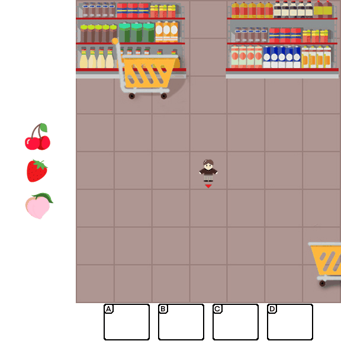
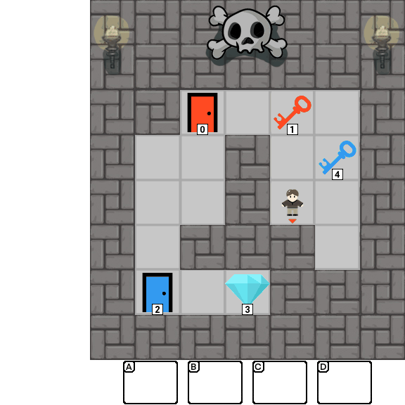
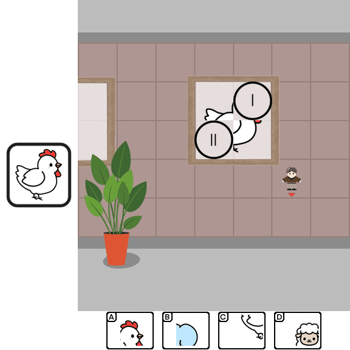
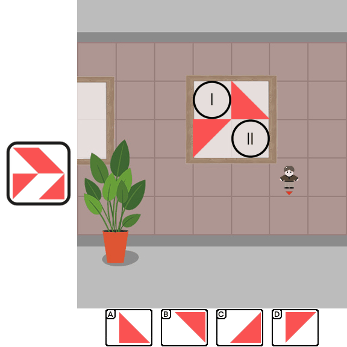
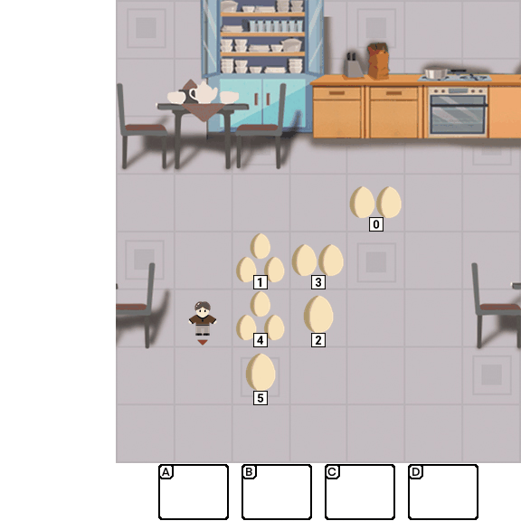
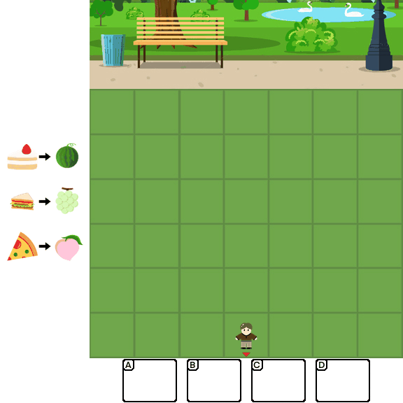
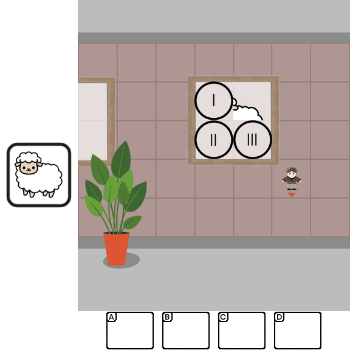

# Children's Intelligence Tests Pose Challenges for MLLMs? KidGym: A 2D Grid-Based Reasoning Benchmark for MLLMs


Multimodal Large Language Models (MLLMs) combine the linguistic strengths of LLMs with the ability to process multimodal data, enabling them to address a broader range of visual tasks. This progression highlights a shift from language-only reasoning to integrated vision–language reasoning in children's development. Inspired by the Wechsler Intelligence Scales, we introduce **KidGym**, a comprehensive 2D grid-based benchmark for assessing five essential capabilities of MLLMs: Execution, Perception Reasoning, Learning, Memory, and Planning. The benchmark comprises 12 unique tasks, each targeting at least one core capability, specifically designed to gauge MLLMs' adaptability and developmental potential, mirroring the stages of children's cognitive growth. Additionally, our tasks encompass diverse scenarios and objects with randomly generated layouts, ensuring a more accurate and robust evaluation of MLLM capabilities. **KidGym** is designed to be fully user-customizable and extensible, allowing researchers to create new evaluation scenarios and adjust difficulty levels to accommodate the rapidly growing MLLM community. Through the evaluation of state-of-the-art MLLMs using **KidGym**, we identified significant insights into model capabilities and revealed several limitations of current models.

## Tasks in KidGym

### Single Capacity Task

|            Scene            |        Task        |                                                                                                                                                                          Description                                                                                                                                                                          |           Capability           |
| :-------------------------: | :-----------------: | :------------------------------------------------------------------------------------------------------------------------------------------------------------------------------------------------------------------------------------------------------------------------------------------------------------------------------------------------------------: | :-----------------------------: |
|  | Classification (CL) |                                                                                             In CL task, the agent is required to place each item into its designated container based on specific instructions, such as*"placing the sushi in the green basket"*.                                                                                             |            Execution            |
|  |     Selection (SE)     | In SE task, several random items will appear in the left hint bar at first. Once the task starts, these items will be hidden, and the agent need to select the items that appeared in the hint bar before. |            Memory            |
|  | Sorting (SO) | In SO task, the agent is presented with a rule that may contradict real-world knowledge. For instance, the agent might be instructed that*"the faster the animal, the heavier it is"*. The agent is expected to correctly rank the animals based on the given rule. | Learning |
|  | Maze (MA) | This task is inspired by [Procgon](https://github.com/openai/train-procgen), where the agent must obtain the diamond in a maze with several locked doors. The agent needs to collect the corresponding colored keys to unlock these doors. | Planning |
|  |    Filling (FI)    |                                             In FI task, the agent will be presented with an image in which a quarter section has been removed, such as*“an elephant with a missing head”*. Then it needs to restore the image by selecting the correct missing piece from a set of distractors in the backpack.                                             |      Perception Reasoning      |
|  |     Puzzle (PU)     |                                                                             In PU task, a target image composed of four puzzle pieces is displayed in the hint bar, and the agent needs to assemble the scattered puzzle pieces from its backpack to reconstruct the target image.                                                                             | Perception Reasoning (Abstract) |

### Composite Capacity Task

|             Scene             |         Task         |                                                                                                                                                               Description                                                                                                                                                               |           Capability           |
| :---------------------------: | :------------------: | :-------------------------------------------------------------------------------------------------------------------------------------------------------------------------------------------------------------------------------------------------------------------------------------------------------------------------------------: | :-----------------------------: |
|  | Placement (PL) | In PL task, the agent is required to place the item in the opposite position based on the given goal. For instance, if the rule states*"place the tortoise on the north side of the toy horse"*, the agent actually needs to place it on the*"south"* side. | Learning + Perception Reasoning |
|    |    Counting (CO)    |                                                             In CO task, the scene contains several piles of items, with quantities ranging from 1 to 3. At the start of the task, the agent is given a target number and then it must collect exactly that number of items.                                                             | Planning + Perception Reasoning |
|  | Decode Maze (DMA) | This task follows the same rules as the “Maze”, with an added challenge. The agent can no longer use a same-colored key to open a door. Instead, it must learn the “key-door” correspondence shown in the hint bar. | Learning + Planning |
|  | Memory Maze (MMA) |                                                                                   This task follows the same rules as the "Maze", with an added challenge. Before the task begins, the agent is shown the location of the diamond, but once the task starts, the diamond in the scene will be hidden and several treasure chests will appear. To succeed, the agent must correctly open the chest containing the diamond.                                                                                   |  Memory + Planning  |
|  |  Memory Decode (MDE)  | This task follows the same rules as "Decode", with an added challenge. The agent must additionally remember the relationships indicated in the code table, which will be hidden once the task starts. |        Memory + Perception Reasoning        |
|  | Memory Filling (MFI) |                                                                  This task follows the same rules as "Filling", with an added challenge. The agent must additionally remember the target, which will disappear once the task starts.                                                                  |        Memory + Learning        |

## Getting Started

[](https://www.python.org/downloads/release/python-3100/)

```cmd
$ conda create -n KidGym python==3.10
$ pip install -r requirements.txt
```

## Using KidGym

KidGym repository's code structure is as follows:

```sh
├── assets/
│   ├── imgs/
│   ├── jsons/
│   └── ...   
├── src/
│   ├── agent.py
│   ├── grid.py
│   └── ...   
├── tasks/
│      ├── task_1.py
│      ├── task_2.py
│      └── ...
└── main.py
```

Each task type is a **class** file located in `tasks/` and you can run it by:

```cmd
$ python main.py --task = <task_name>_<difficulty_level>
```

For example, you can run `python main.py --task = CL_L1` to test Classification Level-1.

## Citing KidGym

```
@inproceedings{ye2026kidgym,
  title     = {Children's Intelligence Tests Pose Challenges for MLLMs? KidGym: A 2D Grid-Based Reasoning Benchmark for MLLMs},
  author    = {Ye, Hengwei and Guan, Yuanting and Ge, Yuxuan and Zhu, Tianying and Guan, Zhenhan and Zhong, Yijia and Zhang, Yijing and Zhang, Han and Wu, Yingna and Tian, Zheng},
  booktitle = {International Conference on Learning Representations (ICLR)},
  year      = {2026}
}
```
